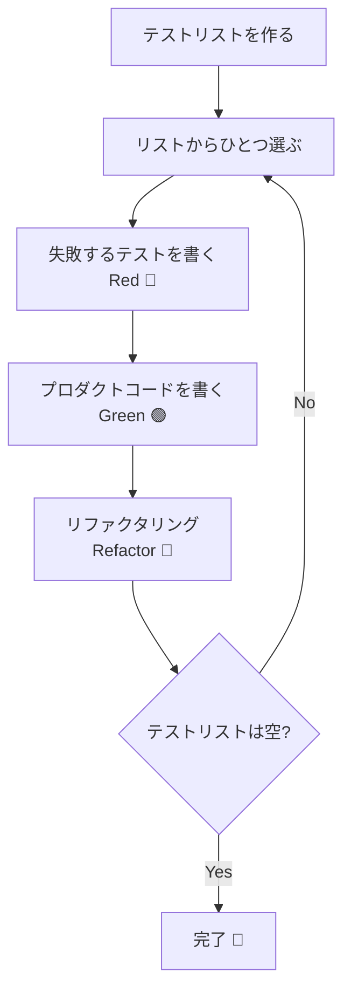

## TL;DR

- t_wadaさんによるTDDの5ステップ定義をGoコードで体験できます
- テストリスト → Red → Green → Refactor のリズムを、FizzBuzzを題材にしながら段階的に身につけられます
- `go test` だけで完結するシンプルな環境で、TDDの思考プロセスを追体験できます
- リファクタリングを「テストが通った後にやること」として意識できるようになります

## はじめに

「TDDってなんとなく知っているけど、実際にどう進めればいいかわからない」と思っていませんか？

本記事では、[t_wadaさんのポスト](https://x.com/t_wada/status/2036966738840215935)で定義されたTDDの5ステップを、GoのシンプルなFizzBuzz実装を題材に追体験します。TDDは「テストを先に書くだけ」ではなく、**テストリストという設計行為からはじまるリズム**です。そのリズムを体感することを目標にしてみましょう。

## 1. TDDの5ステップを理解する

t_wadaさんの定義を整理すると、TDDは以下の5ステップで構成されます。

1. 押さえておきたいテストシナリオを洗い出し、**テストリスト**にまとめる
2. テストリストの中から「ひとつだけ」選び出し、**失敗するテストコード**（Red）に翻訳する
3. プロダクトコードを変更し、テストを**成功させる**（Green）
4. 必要に応じて**リファクタリング**を行い、設計を改善する
5. テストリストが**空になるまで**ステップ2に戻って繰り返す

Mermaidで流れを図示します。


つまり、TDDの本質は **「何を作るかのリストを管理しながら、小さく回し続けること」** です。

## 2. 環境構築

本記事で使う環境は以下の通りです。

| 項目                 | バージョン                    |
| -------------------- | ----------------------------- |
| Go                   | 1.22以降                      |
| テストフレームワーク | 標準 `testing` パッケージのみ |

```bash
go version
```
{: .filepath}
```text
go version go1.22.0 darwin/arm64
```

プロジェクトを作成します。
```bash
mkdir tdd-fizzbuzz && cd tdd-fizzbuzz
go mod init example.com/fizzbuzz
```

> この記事はサードパーティのテストライブラリを一切使いません。標準の `testing` パッケージだけで、TDDのリズムは十分体験できます。
> {: .prompt-tip }

## 3. ステップ1 — テストリストを作る

コードを書く前に、まず**テストリスト**を作ります。これはTDDにおける「設計の最初の一手」です。

FizzBuzzの仕様は以下の通りです。

- 3の倍数なら `"Fizz"` を返す
- 5の倍数なら `"Buzz"` を返す
- 15の倍数なら `"FizzBuzz"` を返す
- それ以外は数字をそのまま文字列で返す

この仕様からテストリストを起こしてみます。コメントファイルとして管理するのが最もシンプルです。
```go
// TODO テストリスト
// [ ] 1 を渡すと "1" を返す
// [ ] 3 を渡すと "Fizz" を返す
// [ ] 5 を渡すと "Buzz" を返す
// [ ] 15 を渡すと "FizzBuzz" を返す
// [ ] 6 を渡すと "Fizz" を返す（3の倍数）
// [ ] 10 を渡すと "Buzz" を返す（5の倍数）
```

> テストリストはコードである必要はありません。紙やメモ帳でも構いません。大切なのは「今自分が何を作ろうとしているかを明示すること」です。
> {: .prompt-info }

## 4. ステップ2〜5 — Red / Green / Refactor を回す

### 4-1. 最初の1件：「1 → "1"」

テストリストから最もシンプルなものを選びます。**「1を渡すと "1" を返す」** から始めましょう。

**Red 🔴 — 失敗するテストを書く**
```go
package fizzbuzz_test

import (
	"testing"

	"example.com/fizzbuzz"
)

func TestFizzBuzz_普通の数字(t *testing.T) {
	got := fizzbuzz.FizzBuzz(1)
	want := "1"
	if got != want {
		t.Errorf("FizzBuzz(1) = %q, want %q", got, want)
	}
}
```
{: file='fizzbuzz_test.go'}

この時点では `fizzbuzz` パッケージが存在しないのでコンパイルエラーになります。これが **Red** の状態です。
```bash
go test ./...
```
```text
cannot find package "example.com/fizzbuzz"
```

**Green 🟢 — テストを通す最小限のコードを書く**
```go
package fizzbuzz

import "strconv"

func FizzBuzz(n int) string {
	return strconv.Itoa(n)
}
```
{: file='fizzbuzz.go'}
```bash
go test ./...
```
```text
ok  	example.com/fizzbuzz	0.001s
```

**Refactor 🔵 — 改善の余地は？**

この時点では実装がシンプルすぎるため、リファクタリングは不要です。テストリストを更新します。
```go
// [x] 1 を渡すと "1" を返す
// [ ] 3 を渡すと "Fizz" を返す
// ...
```

### 4-2. 2件目：「3 → "Fizz"」

**Red 🔴 — 失敗するテストを追加する**
```go
func TestFizzBuzz_Fizz(t *testing.T) {
	got := fizzbuzz.FizzBuzz(3)
	want := "Fizz"
	if got != want {
		t.Errorf("FizzBuzz(3) = %q, want %q", got, want)
	}
}
```
{: file='fizzbuzz_test.go'}
```bash
go test ./...
```
```text
--- FAIL: TestFizzBuzz_Fizz (0.00s)
    fizzbuzz_test.go:XX: FizzBuzz(3) = "3", want "Fizz"
FAIL
```

**Green 🟢**
```go
func FizzBuzz(n int) string {
	if n%3 == 0 {
		return "Fizz"
	}
	return strconv.Itoa(n)
}
```
{: file='fizzbuzz.go'}
```bash
go test ./...
```
```text
ok  	example.com/fizzbuzz	0.001s
```

> 「最短でテストを通すコード」を書くことが Green フェーズの目的です。きれいに書こうとするのは Refactor フェーズまで我慢しましょう。
> {: .prompt-tip }

### 4-3. 3件目：「5 → "Buzz"」

**Red 🔴**
```go
func TestFizzBuzz_Buzz(t *testing.T) {
	got := fizzbuzz.FizzBuzz(5)
	want := "Buzz"
	if got != want {
		t.Errorf("FizzBuzz(5) = %q, want %q", got, want)
	}
}
```
{: file='fizzbuzz_test.go'}

**Green 🟢**
```go
func FizzBuzz(n int) string {
	if n%3 == 0 {
		return "Fizz"
	}
	if n%5 == 0 {
		return "Buzz"
	}
	return strconv.Itoa(n)
}
```
{: file='fizzbuzz.go'}

### 4-4. 4件目：「15 → "FizzBuzz"」

ここが重要なポイントです。15は3でも5でも割り切れるため、**判定の順序**が問われます。

**Red 🔴**
```go
func TestFizzBuzz_FizzBuzz(t *testing.T) {
	got := fizzbuzz.FizzBuzz(15)
	want := "FizzBuzz"
	if got != want {
		t.Errorf("FizzBuzz(15) = %q, want %q", got, want)
	}
}
```
{: file='fizzbuzz_test.go'}

現在の実装では `n%3 == 0` に引っかかり `"Fizz"` を返してしまいます。
```text
--- FAIL: TestFizzBuzz_FizzBuzz (0.00s)
    fizzbuzz_test.go:XX: FizzBuzz(15) = "Fizz", want "FizzBuzz"
```

**Green 🟢**
```go
func FizzBuzz(n int) string {
	if n%15 == 0 {
		return "FizzBuzz"
	}
	if n%3 == 0 {
		return "Fizz"
	}
	if n%5 == 0 {
		return "Buzz"
	}
	return strconv.Itoa(n)
}
```
{: file='fizzbuzz.go'}
```bash
go test ./...
```
```text
ok  	example.com/fizzbuzz	0.001s
```

**Refactor 🔵 — テーブルドリブンテストに整理する**

ここで立ち止まってみましょう。テストコードを見ると、同じ構造の関数が並んでいます。Goのイディオムである**テーブルドリブンテスト**にリファクタリングしましょう。
```go
package fizzbuzz_test

import (
	"testing"

	"example.com/fizzbuzz"
)

func TestFizzBuzz(t *testing.T) {
	tests := []struct {
		name  string
		input int
		want  string
	}{
		{"普通の数字", 1, "1"},
		{"3の倍数", 3, "Fizz"},
		{"5の倍数", 5, "Buzz"},
		{"15の倍数", 15, "FizzBuzz"},
		{"3の別の倍数", 6, "Fizz"},
		{"5の別の倍数", 10, "Buzz"},
	}

	for _, tt := range tests {
		t.Run(tt.name, func(t *testing.T) {
			got := fizzbuzz.FizzBuzz(tt.input)
			if got != tt.want {
				t.Errorf("FizzBuzz(%d) = %q, want %q", tt.input, got, tt.want)
			}
		})
	}
}
```
{: file='fizzbuzz_test.go'}
```bash
go test ./... -v
```
```text
=== RUN   TestFizzBuzz
=== RUN   TestFizzBuzz/普通の数字
=== RUN   TestFizzBuzz/3の倍数
=== RUN   TestFizzBuzz/5の倍数
=== RUN   TestFizzBuzz/15の倍数
=== RUN   TestFizzBuzz/3の別の倍数
=== RUN   TestFizzBuzz/5の別の倍数
--- PASS: TestFizzBuzz (0.00s)
ok  	example.com/fizzbuzz	0.001s
```

> リファクタリングは「すべてのテストが Green の状態」でのみ行います。テストが失敗している状態でリファクタリングをしてはいけません。
> {: .prompt-warning }

**Refactor 🔵 — プロダクトコードも整理する（任意）**

プロダクトコードも少し整理してみます。
```go
package fizzbuzz

import "strconv"

func FizzBuzz(n int) string {
	switch {
	case n%15 == 0:
		return "FizzBuzz"
	case n%3 == 0:
		return "Fizz"
	case n%5 == 0:
		return "Buzz"
	default:
		return strconv.Itoa(n)
	}
}
```
{: file='fizzbuzz.go'}
```bash
go test ./...
```
```text
ok  	example.com/fizzbuzz	0.001s
```

引き続き Green を維持できています。

## 5. テストリストが空になったら完了

最終的なテストリストを確認します。
```go
// [x] 1 を渡すと "1" を返す
// [x] 3 を渡すと "Fizz" を返す
// [x] 5 を渡すと "Buzz" を返す
// [x] 15 を渡すと "FizzBuzz" を返す
// [x] 6 を渡すと "Fizz" を返す（3の倍数）
// [x] 10 を渡すと "Buzz" を返す（5の倍数）
```

すべてチェックが入りました。ステップ5の「テストリストが空になるまで繰り返す」が完了です。

## 6. 最終的なコード全体
```go
package fizzbuzz

import "strconv"

func FizzBuzz(n int) string {
	switch {
	case n%15 == 0:
		return "FizzBuzz"
	case n%3 == 0:
		return "Fizz"
	case n%5 == 0:
		return "Buzz"
	default:
		return strconv.Itoa(n)
	}
}
```
{: file='fizzbuzz.go'}
```go
package fizzbuzz_test

import (
	"testing"

	"example.com/fizzbuzz"
)

func TestFizzBuzz(t *testing.T) {
	tests := []struct {
		name  string
		input int
		want  string
	}{
		{"普通の数字", 1, "1"},
		{"3の倍数", 3, "Fizz"},
		{"5の倍数", 5, "Buzz"},
		{"15の倍数", 15, "FizzBuzz"},
		{"3の別の倍数", 6, "Fizz"},
		{"5の別の倍数", 10, "Buzz"},
	}

	for _, tt := range tests {
		t.Run(tt.name, func(t *testing.T) {
			got := fizzbuzz.FizzBuzz(tt.input)
			if got != tt.want {
				t.Errorf("FizzBuzz(%d) = %q, want %q", tt.input, got, tt.want)
			}
		})
	}
}
```
{: file='fizzbuzz_test.go'}

## まとめ

本記事で体験したTDDの流れを振り返ります。

- **テストリスト**を先に作ることで、「何を作るか」を明確にしてから実装を始められます
- **ひとつずつ**選んで Red → Green → Refactor を回すことで、常に動く状態を保ちながら進められます
- **Green になってからリファクタリング**するというルールを守ることで、安全に設計を改善できます
- **テストリストが空になること**がゴールであり、進捗の可視化にもなります

TDDはテスト手法というより**開発のリズム**です。最初は窮屈に感じるかもしれませんが、慣れてくると「次に何をすべきか」が常にクリアな状態で開発できる心地よさが出てきます。ぜひ日々のGoコードで試してみてください。
