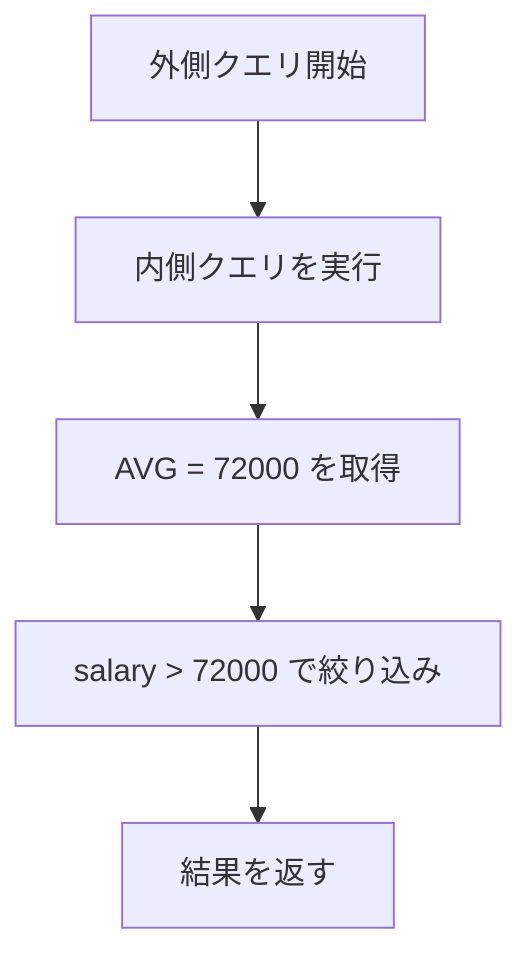
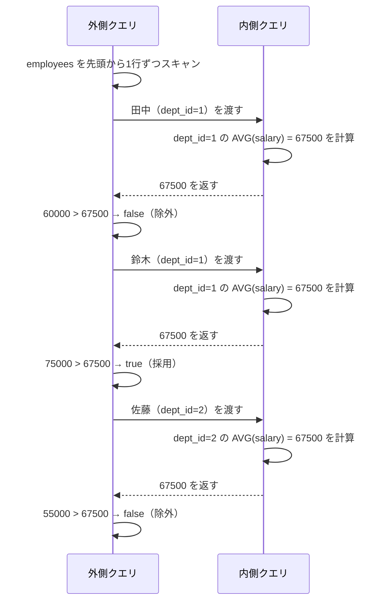

## TL;DR

- 相関副問い合わせは「外側クエリの値を内側で参照する」副問い合わせである
- 通常の副問い合わせと異なり、外側の行ごとに内側が実行される
- 処理順序を頭でトレースできるようになると、読み書きが格段に楽になる
- `EXISTS` は相関副問い合わせと組み合わせることで真価を発揮する

## はじめに

SQLを書いていると、どこかで「相関副問い合わせ」という言葉に出くわします。副問い合わせ自体は使えるのに、「相関」が付いた途端に急に自信がなくなる、という経験はないでしょうか。

この記事では、普通の副問い合わせを起点に、相関副問い合わせが何をやっているのかを丁寧に解説していきます。処理がどの順番で動いているかを追えるようになれば、初見のクエリでも冷静に読めるようになります。

サンプルデータは以下のテーブルを使います。

```sql
-- 社員テーブル
CREATE TABLE employees (
    id       INT,
    name     VARCHAR(50),
    dept_id  INT,
    salary   INT
);

-- 部署テーブル
CREATE TABLE departments (
    id   INT,
    name VARCHAR(50)
);
```

```text
employees
+----+--------+---------+--------+
| id | name   | dept_id | salary |
+----+--------+---------+--------+
|  1 | 田中   |       1 |  60000 |
|  2 | 鈴木   |       1 |  75000 |
|  3 | 佐藤   |       2 |  55000 |
|  4 | 高橋   |       2 |  80000 |
|  5 | 渡辺   |       3 |  90000 |
+----+--------+---------+--------+

departments
+----+----------+
| id | name     |
+----+----------+
|  1 | 開発部   |
|  2 | 営業部   |
|  3 | 総務部   |
+----+----------+
```

## 普通の副問い合わせ（非相関副問い合わせ）

### 仕組みと特徴

副問い合わせ（サブクエリ）とは、クエリの中に別のクエリを埋め込む書き方です。まず「普通の」副問い合わせを確認しておきましょう。

全社員の平均給与より高い給与をもらっている社員を取得する例です。

```sql
SELECT name, salary
FROM employees
WHERE salary > (
    SELECT AVG(salary)
    FROM employees
);
```

```text
+--------+--------+
| name   | salary |
+--------+--------+
| 鈴木   |  75000 |
| 高橋   |  80000 |
| 渡辺   |  90000 |
+--------+--------+
```

内側の `SELECT AVG(salary) FROM employees` は**外側のクエリとまったく無関係に実行**されます。つまり、このクエリ全体の処理は次の2ステップです。

1. 内側を実行して結果（`72000`）を得る
2. 外側で `salary > 72000` を評価する



内側が1回だけ実行される点がポイントです。シンプルで理解しやすいですが、これだけでは「外側の行ごとに条件を変えたい」ケースに対応できません。

## 相関副問い合わせ

### 外側の値を内側で使う

相関副問い合わせは、内側のクエリが**外側のテーブルのカラムを参照している**副問い合わせです。

「自分と同じ部署の社員の中で、平均給与より高い給与をもらっている社員を取得する」という例で見てみましょう。

```sql
SELECT name, salary, dept_id
FROM employees AS e1
WHERE salary > (
    SELECT AVG(salary)
    FROM employees AS e2
    WHERE e2.dept_id = e1.dept_id  -- ← e1 は外側のテーブル
);
```

```text
+--------+--------+---------+
| name   | salary | dept_id |
+--------+--------+---------+
| 鈴木   |  75000 |       1 |
| 高橋   |  80000 |       2 |
| 渡辺   |  90000 |       3 |
+--------+--------+---------+
```

`e1.dept_id` が外側クエリのカラムです。内側は外側の行が変わるたびに `dept_id` の値が変わるため、**外側の行ごとに内側が再実行**されます。

### 処理順序を追う

これが相関副問い合わせの核心です。処理の流れを順番に見てみましょう。



> 内側クエリは外側の行数だけ実行されます。行数が多いテーブルではパフォーマンスに注意が必要です。
> {: .prompt-info }

処理の手順を言葉でまとめると次のとおりです。

1. 外側クエリが `employees` を1行目から順にスキャンする
2. 現在の行の `dept_id` を内側クエリに渡す
3. 内側クエリがその `dept_id` に絞った平均給与を計算して返す
4. 返ってきた値と `salary` を比較してWHERE条件を評価する
5. 次の行へ進み、2〜4を繰り返す

つまり、「外側から行を1つ渡す → 内側が答えを返す → 外側が判定する」というやり取りが、行の数だけ繰り返されます。

### エイリアスの役割

相関副問い合わせでは、外側と内側で**同じテーブルを使うことが多い**ため、エイリアスが必須になります。

```sql
FROM employees AS e1  -- 外側
...
FROM employees AS e2  -- 内側
WHERE e2.dept_id = e1.dept_id
```

`e1` と `e2` は同じテーブルですが、別々の参照として扱われます。`e1.dept_id` は「今スキャンしている外側の行の dept_id」、`e2.dept_id` は「内側で絞り込み対象の行の dept_id」です。この区別が曖昧だと読み間違えるので、エイリアスには一貫した命名をつけると混乱しにくいです。

## EXISTSとの組み合わせ

相関副問い合わせと特によく一緒に使われる演算子が `EXISTS` です。「内側のクエリが結果を返すかどうか」で絞り込みたい場面では、相関副問い合わせと `EXISTS` はほぼセットで登場します。

### EXISTSとは

`EXISTS` は「内側のクエリが1行以上返すかどうか」を真偽値で評価する演算子です。`IN` や比較演算子と異なり、**値そのものは使わず、存在するかどうかだけを判定**します。

```sql
WHERE EXISTS (
    SELECT 1
    FROM ...
    WHERE ...
)
```

内側の `SELECT` には慣習的に `1` や `*` を書きますが、返す値は問われないので何でも構いません。

### 使い方の例

「部下が1人以上いる社員を取得する」という条件を `EXISTS` で書くと次のようになります（ここでは `employees` に `manager_id` カラムがある想定です）。

```sql
-- manager_id カラムを追加した想定
SELECT name
FROM employees AS e1
WHERE EXISTS (
    SELECT 1
    FROM employees AS e2
    WHERE e2.manager_id = e1.id
);
```

内側が1行でも返せば `EXISTS` は `true` になり、外側の行が結果に含まれます。

もう少し実用的な例として、「社員が1人以上いる部署だけを取得する」クエリです。

```sql
SELECT d.name
FROM departments AS d
WHERE EXISTS (
    SELECT 1
    FROM employees AS e
    WHERE e.dept_id = d.id
);
```

```text
+----------+
| name     |
+----------+
| 開発部   |
| 営業部   |
| 総務部   |
+----------+
```

`IN` でも同じ結果を得られますが、`EXISTS` には以下の特徴があります。

- 内側の結果が1行見つかった時点で評価を打ち切るため、大量データで有利なことがある
- `NULL` を含む場合に `IN` と挙動が異なるケースがあるため、`NOT EXISTS` は特に `NOT IN` より安全

> `NOT IN` はサブクエリの結果に `NULL` が含まれると全行が `false` になります。`NOT EXISTS` であればそのような罠を踏まずに済みます。
> {: .prompt-warning }

### NOT EXISTSで「存在しない」を表現する

`NOT EXISTS` は「対応する行が存在しない」行を取得したいときに使います。

「一度も注文していない顧客を取得する」といった差集合的な抽出が典型例です。

```sql
-- orders テーブルがある想定
SELECT c.name
FROM customers AS c
WHERE NOT EXISTS (
    SELECT 1
    FROM orders AS o
    WHERE o.customer_id = c.id
);
```

`EXCEPT` や `LEFT JOIN ... IS NULL` でも同じ結果を得られますが、意図が「存在しないことの確認」であれば `NOT EXISTS` が最も読みやすい表現です。

## まとめ

- 普通の副問い合わせは外側と独立して1回だけ実行される
- 相関副問い合わせは内側が外側の値を参照しており、外側の行ごとに再実行される
- 処理の流れは「行を渡す → 内側が答えを返す → 外側が評価する」の繰り返し
- `EXISTS` は値でなく存在の有無を判定するため、`NOT EXISTS` では `NOT IN` の `NULL` 問題を回避できる

相関副問い合わせは、慣れないうちは「内側がどこを参照しているか」が見えにくく感じます。でも処理順序を1行ずつ手でトレースしてみると、やっていることはシンプルだと気づくはずです。見かけたら逃げずに、まず外側と内側の結合条件を探す習慣をつけてみてください。
