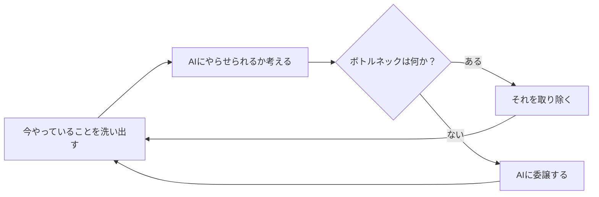
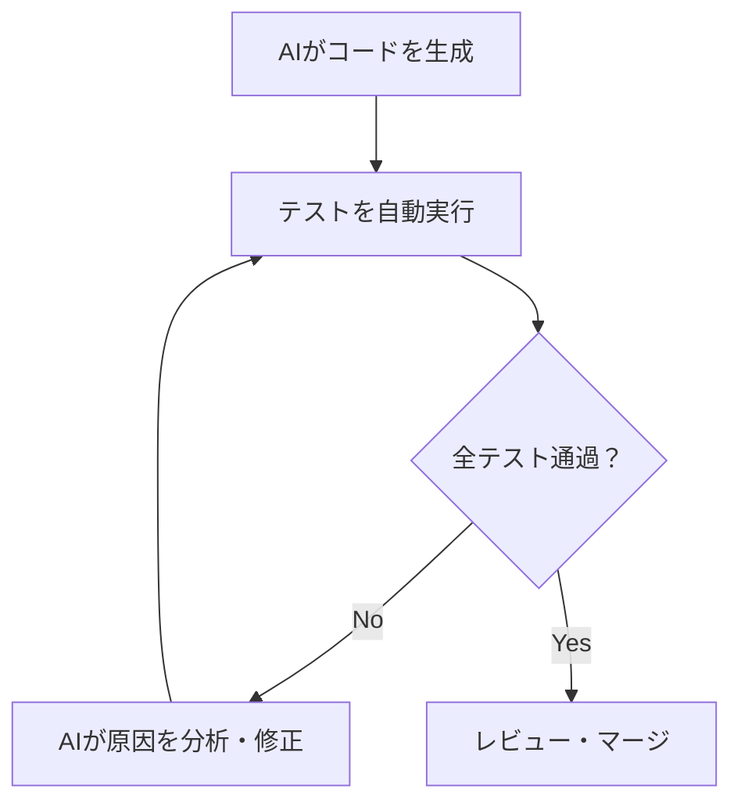

## TL;DR

- AIの活用が進まない原因は「技術」ではなく「環境・テスト・マインド」の3つに集約される
- AIはコンテキストを渡せなければ動けない。ドキュメントの形式と置き場所を見直す必要がある
- 品質担保はテストの自動化で解決できる。AIが自ら検証できる環境を作ることが鍵
- プログラミングという仕事は、なくなる

## はじめに

最終ゴールは、**全てをAIにやらせること**です。

AIは圧倒的に速く、正確です。人間がやる必要のない作業を、人間がやり続ける理由はありません。

エンジニアの仕事は、コードを書くことではなく、**AIが全てをやれる環境を作ること**に変わります。「今やっていることをどうすればAIにやらせられるか」を考え、ボトルネックを特定し、それを取り除く。その繰り返しです。

## AI活用が進まない3つの原因

現場でAI活用が進まないとき、原因はほぼ3つに絞られます。

### 原因1：AIにコンテキストを渡せていない

AIは、情報を与えられなければ動けません。

よくある状況を整理すると：

- **AIが読めない形式で管理されている**：ExcelやPowerPointは、AIのコンテキストに入れるには向いていません
- **AIからアクセスできない場所にある**：特定のSaaS上など、AIのツールが届かない場所に情報が閉じています
- **そもそもドキュメント化されていない**：暗黙知として頭の中にある仕様は、AIにとって存在しないも同然です

解決策は明快です。

- ドキュメントは**Markdownで管理する**
- **Gitリポジトリで一元管理する**、あるいはMCPを使ってAIがアクセスできる経路を作る
- 暗黙知を**言語化してドキュメントに落とす**

> AIに仕事を渡す前に、まず情報をAIが読める形にすることが先決です。
> {: .prompt-tip }

### 原因2：AIが自分で検証する手段がない

AIがコードを書いても、それが正しいかどうかを確かめる手段がなければ、結局人間が手動でテストすることになります。これではスピードが出ません。

理想の状態は、**AIがコードを書き、テストを実行し、失敗したら自分で修正するサイクルを回すこと**です。

そのためには：

- ユニットテスト・インテグレーションテスト・E2Eテストが自動化されていること
- AIがブラウザ操作を含む検証を自律的に行えるツールが揃っていること
- テストが通るまでAIが反復できる環境があること

> AIが自ら検証できない状況にあるなら、今すぐツールを変えるべきです。
> {: .prompt-warning }

### 原因3：マインドが変わっていない

「忙しくてAI活用を試す時間がない」——これはただの言い訳です。AIにやらせた方が早いのだから、忙しいからこそAIを使うべきです。

問題は時間ではなく、**「自分でやった方が早い・確実」という思い込み**です。この思い込みを手放すことが、AI活用の第一歩です。

**つまり、必要なのはマインドの転換です。**

## 品質をどう担保するか

「AIに任せると品質が下がる」という懸念があります。答えは、**全てのレイヤーで徹底的なテストをすること**です。

| テスト種別               | 目的                           |
| ------------------------ | ------------------------------ |
| ユニットテスト           | 関数・モジュール単位の動作検証 |
| インテグレーションテスト | コンポーネント間の連携検証     |
| E2Eテスト                | ユーザー操作レベルの動作検証   |

AIがテストケースを自ら作成し、検証し、合格するまで反復できる環境があれば、品質の担保は人間が手動でやるより堅牢になります。

そのような環境が今ないなら、**今すぐ作るべきです。**

## プログラミングはなくなる

プログラミングと、AIの関係は、走ることと、車の関係に似ています。

{: width="800" height="450" }
_車が登場したことで「速く走ること」の価値が変わったように、AIはプログラミングの価値を変える_

車が登場したことで、「速く移動すること」の経済的な価値は失われました。免許があれば誰でも運転できます。競技としての陸上は今も存在しますが、それは仕事ではありません。

プログラミングも同じ運命を辿ります。AIを使えば、エンジニアでなくてもソフトウェアを作れるようになります。「コードが書ける」こと自体の価値は、急速に下がっていきます。

ただし、**AIを使わないエンジニアは退化します。**

将棋の世界では、AIを活用して研究するプレイヤーとそうでないプレイヤーの間で、実力差が拡大し続けています。人間はAIに勝てませんが、AIを使って学ぶ棋士は強くなり、使わない棋士は勝てなくなります。エンジニアも同じです。

AIを使い、学び続けること。それだけが、これからの格差を決めます。

## まとめ

- **全てをAIにやらせることが、最終ゴールです**
- AIが動ける環境を作ることが、エンジニアの仕事になります
- コンテキストを渡す・検証手段を作る・マインドを変える、この3つがボトルネックです
- テストを徹底することが、AI活用と品質担保を両立する唯一の方法です
- プログラミングという仕事はなくなります。AIを使い続けるエンジニアだけが残ります

今すぐ、目の前のボトルネックを一つ見つけてください。「これをAIにやらせるにはどうすればいいか」——その問いを持ち続けることが、全ての出発点です。
