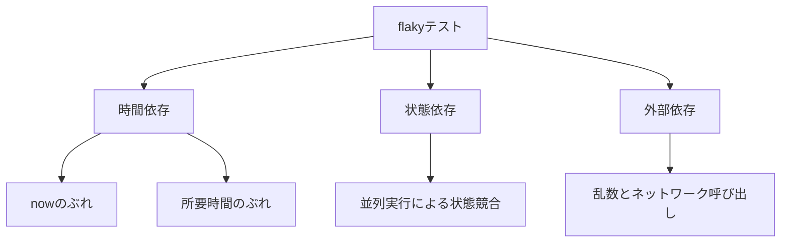

## TL;DR

- flakyテスト（実行するたびに成功したり失敗したりするテスト）が生まれる原因を3パターンに整理します
- 「たまたま落ちただけ」で再実行して済ませるのではなく、原因から直す考え方を身につけられます
- 時間依存、状態依存、外部依存、それぞれのGoの実コード例と修正方法を紹介します
- 読み終える頃には、自分のテストコードのどこにflakyの芽があるか見分けられるようになっているはずです

## はじめに

CIが緑になったり赤になったりを繰り返すテストに出会ったことはありませんか。
コードは何も変えていないのに、再実行すると通ってしまう。
原因を追いかけるうちに、いつの間にか「このテストは元々そういうものだから」と諦めてしまう。
そんな経験がある人は少なくないと思います。

こうした**flakyテスト**（unreliable test、unstable testとも呼ばれます）は、単に自分が困るだけでは終わりません。
CIが赤くなるたびにチームの他のメンバーが「自分の変更が原因か」を確認する手間が発生し、再実行を繰り返すうちに「このテストはどうせ落ちる」という空気が生まれ、本当のバグを見逃す土壌にもなります。

筆者自身も、現在時刻を扱うテストでタイムゾーンが噛み合わずに失敗するケースや、非同期処理の完了を`time.Sleep`で待つテストがCIの負荷次第で失敗するケースに遭遇してきました。
この記事では、こうした経験も踏まえて、flakyテストが生まれる原因を3つのパターンに整理し、それぞれのGoコード例と直し方を紹介します。

## flakyテストとは

「flakyテスト」とは、プロダクションコードを一切変更していないのに、実行するたびに成功したり失敗したりするテストのことです。

「バグを見つけるはずのテストが、逆にノイズを生む」というところに問題があります。
テストが失敗しても「またflakyか」と受け流されるようになると、テストスイート全体の信頼性が失われていきます。

> flakyテストへの対処療法として、失敗したら自動リトライする仕組みを入れているチームもあります。
> しかし、それは症状を隠すだけで、原因を直したことにはなりません。
> この記事では、原因からの解決を扱います。
> {: .prompt-info }

## flakyテストが生まれる3つのパターン

flakyテストの原因は多岐にわたりますが、大きく次の3つに分類できます。



3つとも根っこは同じで、**テストの成否が、テストコード自身がコントロールできない要因に委ねられている**という点です。
「時間依存」は文字通り時間、「状態依存」は他のテストとの相互作用、「外部依存」は乱数やネットワークが、その制御不能な要因にあたります。
それぞれについて、症状、原因、直し方の順で見ていきます。

### 1. 時間依存

時間依存のflakyには、大きく2つの形があります。
今が何時かという値そのものがぶれる**nowのぶれ**と、処理にかかる実時間がぶれる**所要時間のぶれ**です。

#### nowのぶれ

日報にJST（日本時間）での日付ラベルを付ける機能を考えます。

```go
func GenerateDailyReport() Report {
    date := time.Now().Format("2006-01-02") // サーバーのローカルタイムゾーンに依存
    return Report{Date: date}
}
```
{: file='report.go'}

```go
func TestGenerateDailyReport(t *testing.T) {
    jst, _ := time.LoadLocation("Asia/Tokyo")
    want := time.Now().In(jst).Format("2006-01-02")

    got := GenerateDailyReport().Date
    if got != want {
        t.Errorf("got %s, want %s", got, want)
    }
}
```
{: file='report_test.go'}

一見自然なコードですが、CIのコンテナは`TZ=UTC`（多くのDockerイメージのデフォルト）で動いていることが多く、テスト対象の関数はUTCベースの日付を返します。
一方でテストコードは、JSTベースの日付を期待値として計算しています。
UTCとJSTは9時間ずれているため、UTCの15時から24時まで（JSTでは午前0時から9時まで）は日付がずれ、それ以外の15時間は一致します。
CIがたまたま日本時間の深夜から早朝に動いたときだけ失敗するという、実際に遭遇しやすいパターンです。

この失敗の原因は、今が何時かという値が、テスト対象のコードとテストコードの両方で、実行環境のタイムゾーン設定に暗黙のうちに依存していることにあります。

直すには、時刻の取得を関数の外から注入できるようにし、テストでは固定した時刻とタイムゾーンを渡します。

```go
type Clock interface {
    Now() time.Time
}

func GenerateDailyReport(c Clock, loc *time.Location) Report {
    date := c.Now().In(loc).Format("2006-01-02")
    return Report{Date: date}
}
```
{: file='report.go'}

```go
func TestGenerateDailyReport(t *testing.T) {
    jst, _ := time.LoadLocation("Asia/Tokyo")
    fixed := fixedClock{t: time.Date(2026, 8, 29, 20, 0, 0, 0, time.UTC)} // UTCで20時、JSTでは翌日3時

    got := GenerateDailyReport(fixed, jst).Date
    want := "2026-08-30"
    if got != want {
        t.Errorf("got %s, want %s", got, want)
    }
}
```
{: file='report_test.go'}

実行環境の実時間から完全に切り離されるため、日付境界のケースも含めて、何度実行しても同じ結果になります。

#### 所要時間のぶれ

非同期でワーカーが処理した結果を検証するテストを考えます。

```go
func TestProcessAsync(t *testing.T) {
    result := make(chan int, 1)
    go func() {
        result <- process(42)
    }()

    time.Sleep(50 * time.Millisecond) // 処理が終わるのを待つつもり
    select {
    case v := <-result:
        if v != 84 {
            t.Errorf("got %d, want 84", v)
        }
    default:
        t.Fatal("処理が完了していない")
    }
}
```
{: file='process_test.go'}

ローカルではだいたい通ります。
しかしCI環境はローカルよりCPUリソースが制限されていることが多く、`process(42)`の完了に50msより時間がかかると、`select`が`default`側に流れて`t.Fatal`します。
CIの負荷が高いタイミングでだけ失敗する、典型的なflakyです。

この失敗の原因は、処理が50ミリ秒以内に終わるはずだという実時間の見積もりを、テストの合否条件に組み込んでいることにあります。
処理の完了そのものではなく、時間が経てば終わっているだろうという推測を検証してしまっています。

直すには、固定のsleepで待ったつもりになるのをやめ、チャネルの受信で完了を確定的に待ちます。
タイムアウトは、処理がハングした場合だけ発火する安全装置として設定します。

```go
func TestProcessAsync(t *testing.T) {
    result := make(chan int, 1)
    go func() {
        result <- process(42)
    }()

    select {
    case v := <-result:
        if v != 84 {
            t.Errorf("got %d, want 84", v)
        }
    case <-time.After(2 * time.Second): // ハングした場合だけ発火する安全装置
        t.Fatal("timeout waiting for result")
    }
}
```
{: file='process_test.go'}

CPUが混雑していても、`process`が終わり次第すぐに`result`が届くため、テストは即座に完了します。
`time.After`のタイムアウトは、処理が本当にハングしたときだけ発火するので、通常時のflaky要因にはなりません。

> Go 1.24以降の`testing/synctest`パッケージを使うと、goroutineの完了をシミュレートされた時間の中で待つテストを、実際の待機なしに高速かつ決定的に書けます。
> 非同期処理のテストを新しく書く場合は、選択肢に入れておくとよいでしょう。
> {: .prompt-tip }

### 2. 状態依存

単体で実行すると通るのに、`go test -parallel`で並列実行すると結果が不安定になる、あるいはクラッシュするテストを考えます。

```go
var cache = map[string]int{}

func TestCacheSet(t *testing.T) {
    t.Parallel()
    cache["key"] = 1
    if len(cache) != 1 {
        t.Errorf("want 1 entry, got %d", len(cache))
    }
}

func TestCacheAnother(t *testing.T) {
    t.Parallel()
    cache["another"] = 2
    if len(cache) != 1 {
        t.Errorf("want 1 entry, got %d", len(cache))
    }
}
```
{: file='cache_test.go'}

`cache`はパッケージレベルの`map`で、`t.Parallel()`により両方のテストが同時に実行されます。
同じ`map`への並行書き込みは、Goランタイムが検出すると`fatal error: concurrent map writes`でテストバイナリごとクラッシュします。
検出されなくても、どちらの書き込みが先に反映されるかはgoroutineのスケジューリング次第で変わるため、`len(cache)`の結果も実行のたびに変わり得ます。
同じコード、同じコマンドを実行しても、goroutineのスケジューリングという制御できない要因によって結果が変わります。
これが本来の意味でのflakyです。

この失敗の原因は、複数のテストがパッケージレベルのミュータブルな状態を、同期機構なしに共有していることにあります。
テストは本来、他のテストの実行結果に一切左右されないことが前提ですが、可変な共有状態が同時に書き換えられると、その前提が壊れます。

直すには、各テストで独立した状態を都度生成し、パッケージレベルのミュータブルな変数への依存をなくします。

```go
func TestCacheSet(t *testing.T) {
    t.Parallel()
    cache := NewCache() // テストごとに新しいインスタンス
    cache.Set("key", 1)
    if cache.Len() != 1 {
        t.Errorf("want 1 entry, got %d", cache.Len())
    }
}

func TestCacheAnother(t *testing.T) {
    t.Parallel()
    cache := NewCache()
    cache.Set("another", 2)
    if cache.Len() != 1 {
        t.Errorf("want 1 entry, got %d", cache.Len())
    }
}
```
{: file='cache_test.go'}

`NewCache()`でテストごとに新しいインスタンスを生成することで、他のテストと状態を共有しなくなり、`t.Parallel()`を付けても安全になります。
データベースを使うテストでは、`t.Cleanup`でテスト終了後に必ずデータを削除する、あるいはトランザクションをテストごとにロールバックする設計にすると、同様の効果が得られます。

> CIに`go test -race`を組み込んでおくと、この手の共有状態への並行書き込みを、実際に落ちる前の段階で検出できます。
> {: .prompt-tip }

### 3. 外部依存

乱数を使った処理や、外部サービスへのHTTP呼び出しを含むテストが、特定の条件のときだけ失敗するケースを考えます。

```go
func GenerateID() string {
    return fmt.Sprintf("id-%d", rand.Intn(1000))
}

func TestGenerateID(t *testing.T) {
    id := GenerateID()
    if id == "id-0" { // ごく低確率だが起こり得る
        t.Errorf("unexpected id: %s", id)
    }
}
```
{: file='id_test.go'}

シードが固定されていない乱数は、実行するたびに結果が変わります。
低確率とはいえ、テストが失敗する条件を含んでいる時点でflakyです。
外部APIを直接叩くテストも同様で、相手のレイテンシやレート制限、ネットワークの瞬断がそのままテストの成否に直結してしまいます。

この失敗の原因は、テストの成否が、テストコード自身がコントロールできない要因、つまり乱数の出目やネットワークの状態に委ねられていることにあります。

直すには、乱数生成器やHTTPクライアントを注入可能にし、テストでは決定的な値やモックに差し替えます。

```go
type IDGenerator struct {
    rnd *rand.Rand
}

func NewIDGenerator(seed int64) *IDGenerator {
    return &IDGenerator{rnd: rand.New(rand.NewSource(seed))}
}

func (g *IDGenerator) Generate() string {
    return fmt.Sprintf("id-%d", g.rnd.Intn(1000))
}
```
{: file='id.go'}

```go
func TestGenerateID(t *testing.T) {
    g := NewIDGenerator(42) // 固定シードで決定的に
    id := g.Generate()
    want := "id-644" // シード42のときに常に得られる値
    if id != want {
        t.Errorf("got %s, want %s", id, want)
    }
}
```
{: file='id_test.go'}

外部サービス呼び出しについては、`net/http/httptest`でスタブサーバーを立てるか、HTTPクライアント部分をインターフェースとして注入できるように設計しておくと、ネットワークの状態に関わらず決定的なテストが書けます。

> 外部サービスとの実際の疎通を確認したい場合は、それ専用の統合テストとして分離し、単体テストのスイートには含めないのがおすすめです。
> 両者を混ぜると、ネットワークの不安定さが単体テスト全体の信頼性を下げてしまいます。
> {: .prompt-tip }

## まとめ

flakyテストの原因を3つのパターンに整理しました。

- **時間依存**：今が何時かと、処理にかかる実時間、どちらも実時間そのものをテストの合否条件にしないことです。時刻は注入し、非同期処理は`time.Sleep`ではなくチャネルで確定的に待ちます
- **状態依存**：パッケージレベルのミュータブルな変数を避け、テストごとに独立した状態を用意することです。CIに`-race`を組み込むと早期発見できます
- **外部依存**：乱数はシードを固定し、外部サービス呼び出しはモックやスタブに差し替えることです

いずれのパターンにも共通しているのは、テストの成否が、自分たちがコントロールできない何かに委ねられているという点です。
flakyテストを見つけたときは、まず再実行で誤魔化さずに、どの依存が制御不能になっているかを疑ってみると、直し方が見えてくると思います。
