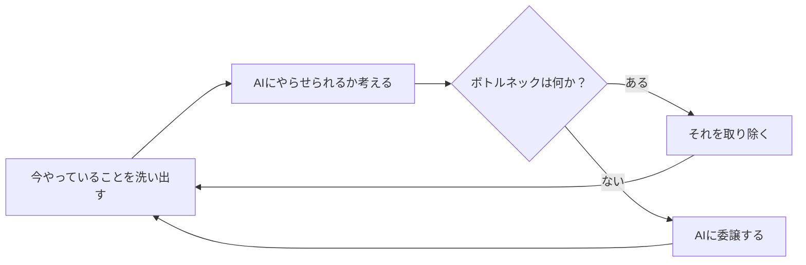
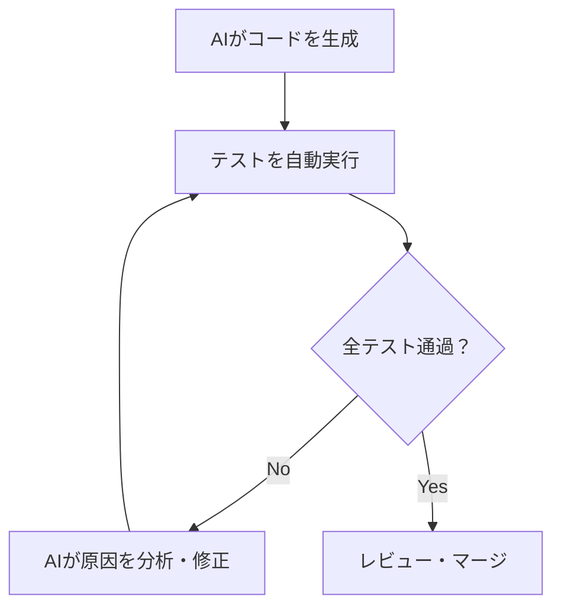

## TL;DR

- AIの活用が進まない原因は、「技術」ではなく「環境」「テスト」「マインド」の3つに集約される
- AIはコンテキストを渡せなければ動けない。ドキュメントの形式と置き場所を見直す必要がある
- 品質はテストの自動化で担保する。AIが自ら検証できる環境を作ることが要になる
- プログラミングという仕事は、なくなる

## はじめに

AIをどこまで開発に使うか、多くのチームで議論になります。

最終的なゴールは一つで、全てをAIにやらせることです。

AIは人間より速く、正確に作業をこなします。
人間がやる必要のない作業を、人間がやり続ける理由はありません。

エンジニアの仕事は、コードを書くことから、AIが全てをやれる環境を作ることへと変わっていきます。
「今やっていることをどうすればAIにやらせられるか」を考え、ボトルネックを特定し、それを取り除く。
その繰り返しです。

## AI活用が進まない3つの原因

現場でAI活用が進まないとき、原因はほぼ3つに絞られます。

### 原因1：AIにコンテキストを渡せていない

AIは、情報を与えられなければ動けません。

よくある状況を整理すると、次のようになります。

- **AIが読めない形式で管理されている**：ExcelやPowerPointはテキストとして構造化されておらず、AIのコンテキストに読み込むには向いていません
- **AIからアクセスできない場所にある**：特定のSaaS上など、AIのツールが届かない場所に情報が閉じています
- **そもそもドキュメント化されていない**：暗黙知として頭の中にある仕様は、AIにとって存在しないも同然です

解決策は明快です。

- ドキュメントはMarkdownで管理する
- Gitリポジトリで一元管理する、あるいはMCPを使ってAIがアクセスできる経路を作る
- 暗黙知を言語化してドキュメントに落とす

> AIに仕事を渡す前に、まず情報をAIが読める形にすることが先決です。
> {: .prompt-tip }

### 原因2：AIが自分で検証する手段がない

AIがコードを書いても、それが正しいかどうかを確かめる手段がなければ、結局人間が手動でテストすることになります。
これではスピードが出ません。

理想の状態は、AIがコードを書き、テストを実行し、失敗したら自分で修正するサイクルを回すことです。

そのためには、次の条件が必要です。

- ユニットテスト、インテグレーションテスト、E2Eテストが自動化されていること
- AIがブラウザ操作を含む検証を自律的に行えるツールが揃っていること
- テストが通るまでAIが反復できる環境があること

> AIが自ら検証できない状況にあるなら、今すぐツールを変えるべきです。
> {: .prompt-warning }

### 原因3：マインドが変わっていない

「忙しくてAI活用を試す時間がない」という声を聞きますが、これは言い訳にすぎません。
AIにやらせた方が早いのですから、忙しいときこそAIを使うべきです。

問題は時間ではなく、「自分でやった方が早く、確実だ」という思い込みです。
この思い込みを手放すことが、AI活用の第一歩になります。
求められているのは、マインドの転換です。

## 品質をどう担保するか

「AIに任せると品質が下がる」という懸念があります。
その答えは、全てのレイヤーでテストを自動化することにあります。

| テスト種別               | 目的                           |
| ------------------------ | ------------------------------ |
| ユニットテスト           | 関数やモジュール単位の動作検証 |
| インテグレーションテスト | コンポーネント間の連携検証     |
| E2Eテスト                | ユーザー操作レベルの動作検証   |

AIがテストケースを自ら作成し、検証し、合格するまで反復できる環境があれば、AIは疲れず何度でも同じ検証を繰り返せるため、品質の担保は人手による確認より堅牢になりやすくなります。

そのような環境が今ないなら、今すぐ作るべきです。

## プログラミングという仕事の行方

プログラミングとAIの関係は、走ることと車の関係に似ています。

{: width="800" height="450" }
_車が登場したことで「速く走ること」の価値が変わったように、AIはプログラミングの価値を変える_

車が登場したことで、「速く移動すること」の経済的な価値は失われました。
免許があれば誰でも運転できるからです。
競技としての陸上は今も存在しますが、それは仕事ではありません。

プログラミングも同じ運命をたどります。
AIを使えば、エンジニアでなくてもソフトウェアを作れるようになります。
「コードが書ける」こと自体の価値は、急速に下がっていきます。

ただし、**AIを使わないエンジニアは退化します。**

将棋の世界では、AIを活用して研究するプレイヤーとそうでないプレイヤーの間で、実力差が拡大し続けています。
人間はAIに勝てませんが、AIを使って学ぶ棋士は強くなり、使わない棋士は勝てなくなります。
エンジニアも同じです。

AIを使い、学び続けること。
それだけが、これからの格差を決めます。

## まとめ

今の仕事の中から、AIに渡せそうなものを一つ選んでみてください。

コンテキストを渡せる形にし、AIが自分で検証できる環境を整え、「自分でやった方が早い」という思い込みを手放す。
この3つを一つずつ潰していくことが、AIネイティブな開発への一番の近道です。
